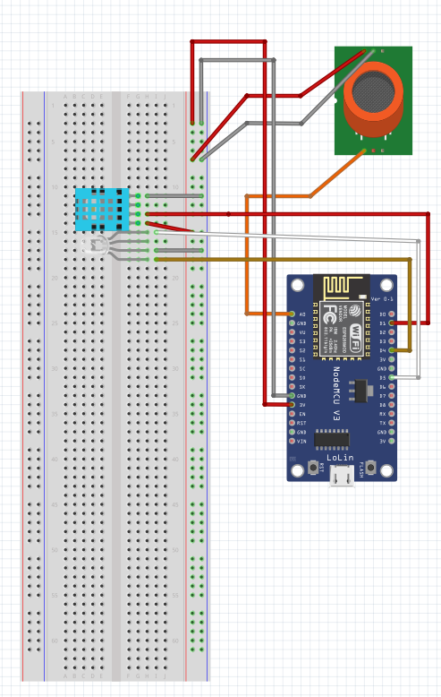

# Summary
Project is fire alert system. There are 2 software that will use. First one will placed on computer. Another software will be on MCU. When fire begun buzzer and computer sound will run.

## Circuit image

